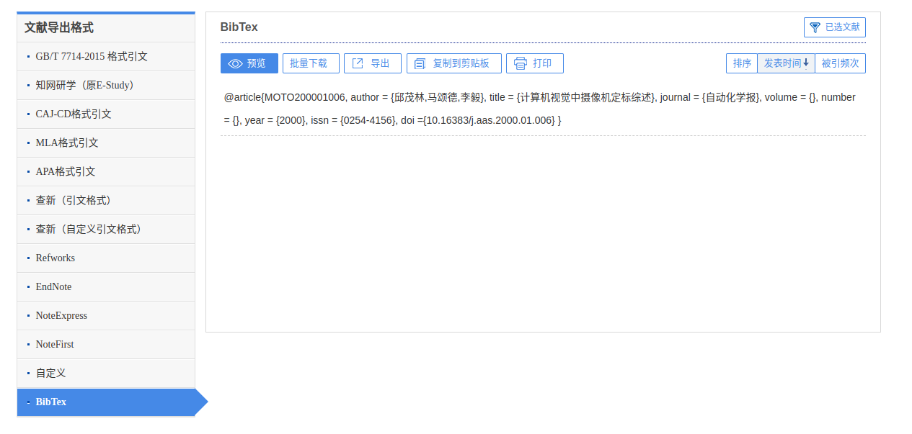
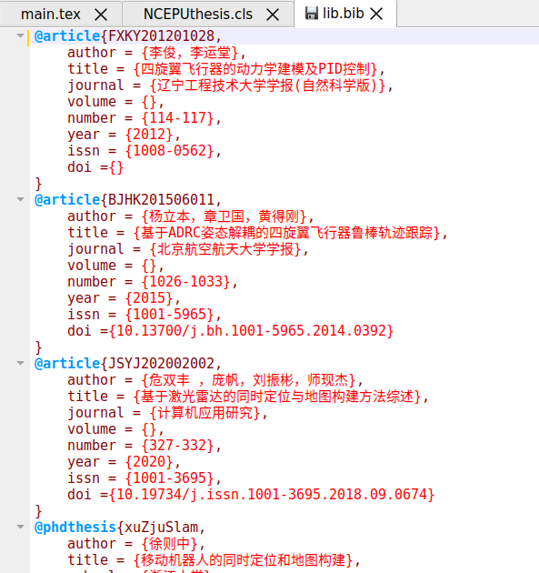

# 概述

由于华电本没有一个官方的latex毕设模板，所以我自己用自学的latex知识，独自创建啦一个，争取实现简洁易用，让广大华电学子用最少的精力就可以完成精美的毕设排版

# 多级标题用法

```tex
\NCEPUsection{文本}
```

使用这个命令，可以生成一级标题，而且带有编号和居中显示，同时目录上会自动排版新增章节，同时会自动新的一页开始，这里一级标题的格式符合教务处给出的格式

```tex
\NCEPUsubsection{文本}
```

这里会生成一个二级标题，但是不居中，序号形式为1.1、2.1这种

类似的还有

```tex
\NCEPUsubsubsection{文本}
```

生成一个三级标题

# 参考文献用法

使用LaTeX方法，我们可以自动进行参考文献的排版和自由引用

首先我们要获取参考文献的信息

<center>
    
</center>

这是知网上论文的页面，大家看右上角

<center>
    
</center>

有五个小图标，最左边的图标就是这个文献的引用信息，我们点击就会出现以下界面

<center>
    
</center>

我们点击这个界面的右下角“更多引用格式”，转到这个界面

<center>
    
</center>

选择导出格式为BibTeX，然后把右边的信息复制到粘贴板

<center>
    
</center>

然后按照这个格式复制粘贴到lib.bib文件里面，然后在主文件里面多次编译（**大概要编译四五次，才可以显示新加入的文献**），因为需要多次编译才可以正常显示新内容，所以建议大家先加入文献，编译并且正常显示后再进行使用